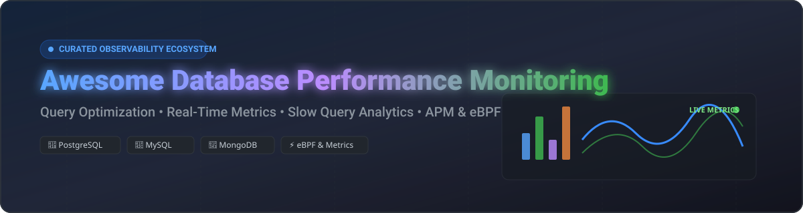

# 📊 Awesome Database Performance Monitoring 🚀

[](https://github.com/ishandutta2007/Awesome-Awesome-Awesome)<a href="https://discord.gg/jc4xtF58Ve"></a>
[](https://github.com/ishandutta2007/Awesome-Database-Performance-Monitoring)
[](LICENSE)
[](https://github.com/ishandutta2007/Awesome-Awesome-Awesome)
<a href="https://github.com/ishandutta2007"></a>

<p align="center">
  
</p>

## 🌟 Top Database Performance Monitoring Platforms Ecosystem

**A Curated List of SaaS Products & Open-Source GitHub Projects**

*Focused on Query Performance, Real-Time Metrics, Slow Query Analysis, APM, eBPF & Database Observability*

**Last updated: October 2026** 📅

---

This repository tracks notable **SaaS platforms** and **open-source projects** for **Database Performance Monitoring (DPM)** and **Database Observability**. These tools empower DBAs, Site Reliability Engineers (SREs), and platform engineers to identify slow queries, detect deadlock locks, monitor connection pools, track resource utilization, analyze execution plans, and optimize database performance across PostgreSQL, MySQL, MariaDB, MongoDB, Microsoft SQL Server, Oracle, and cloud-native database engines. ⚡

---

## 📑 Table of Contents

- [📈 Market Overview & Size](#-market-overview--size)
- [☁️ SaaS & Commercial Platforms](#️-saas--commercial-platforms)
- [🔓 Open-Source GitHub Projects](#-open-source-github-projects)
- [🛠️ Frameworks & Stack Building](#️-frameworks--stack-building)
- [🤝 How to Contribute](#-how-to-contribute)
- [☕ Support & Community](#-support--community)
- [⚠️ Disclaimer](#️-disclaimer)
- [📈 Star History](#-star-history)

---

## 📈 Market Overview & Size

> **Estimated Market Size:** The global Database Performance Monitoring & Observability sector is valued at **$6.2 Billion (2026)** and projected to expand at a CAGR of ~14.5% toward $11.5 Billion by 2030.
>
> **Market Dynamics:** The market is **moderately fragmented**, bridging multi-billion dollar observability tech giants (Datadog, Dynatrace) with enterprise database management vendors (Quest Foglight, SolarWinds, Redgate) and niche AI-native query tuners. While cloud APM aggregators capture broad developer mindshare, specialized database workload analyzers maintain strong moats due to deep engine-specific wait-state and lock telemetry. 📊

---

## ☁️ SaaS & Commercial Platforms

Commercial platforms provide deep wait-time analysis, query execution plan tracking, automated index recommendations, cross-stack telemetry correlation, and SLA guarantee support for enterprise database fleets.

The table below lists leading SaaS and commercial database performance monitoring products, sorted by **Company Size / Valuation (Descending)** 🏢:

| Platform / Vendor | Vendor Size / Valuation (Est.) | Starting Price (USD) | Free Tier & Trial Limits | Supported Engines & Core Capabilities |
| :--- | :--- | :--- | :--- | :--- |
| **[Datadog Database Monitoring](https://www.datadoghq.com/product/database-monitoring/)** 🐶 | **~$95.0B** (Public: DDOG) | **$70** / db host / mo | **14-day free trial** (Full feature access, unrestricted telemetry) | PostgreSQL, MySQL, SQL Server, Oracle, MongoDB. Real-time query execution plans, wait event metrics, and APM trace correlation. |
| **[Dynatrace Database Observability](https://www.dynatrace.com/)** 🔮 | **~$15.2B** (Public: DT) | **$0.08** / host hr (~$58/mo) | **15-day free trial** (1,000 Davis credit units included) | PostgreSQL, MySQL, Oracle, DB2, SAP HANA. Automated root-cause detection powered by Davis AI and end-to-end transaction tracing. |
| **[New Relic Database Performance](https://newrelic.com/)** 📊 | **~$6.5B** (Private - Francisco Partners) | **$0.35** / GB ingested | **Forever Free Tier** (100 GB/mo data ingest + 1 Full User free forever) | PostgreSQL, MySQL, SQL Server, Redis. Slow query trace analysis, query response duration distribution, and infrastructure correlation. |
| **[Quest Foglight for Databases](https://www.quest.com/foglight/)** 🎯 | **~$4.2B** (Private - Clearlake Capital) | **$1,500** / db instance (Quote) | **30-day free trial** (Full enterprise evaluation edition download) | Oracle, SQL Server, PostgreSQL, MySQL, Azure SQL. SQL PI (Performance Investigator) deep wait-state multidimensional analysis. |
| **[SolarWinds Database Performance Analyzer (DPA)](https://www.solarwinds.com/database-performance-analyzer)** ☀️ | **~$1.8B** (Public: SWI) | **$1,699** / instance | **14-day free trial** (Fully functional evaluation license) | Oracle, SQL Server, MySQL, MariaDB, PostgreSQL, DB2. Response-time wait analysis, blocking/deadlock detection, and anomaly detection. |
| **[Redgate SQL Monitor](https://www.red-gate.com/products/sql-monitor/)** 🚩 | **~$120M** Revenue (Private) | **$1,233** / server / yr | **14-day free trial** (Unrestricted server monitoring edition) | SQL Server & PostgreSQL estates. Real-time blocking alerts, index fragmentation analyzer, tempdb usage metrics, and capacity planning. |
| **[Site24x7 Database Monitoring](https://www.site24x7.com/)** 🌐 | **~$100M** Division (Zoho Corp) | **$9** / mo (Starter Plan) | **30-day free trial** (No credit card required; monitors up to 10 resources) | MySQL, PostgreSQL, SQL Server, MongoDB, Redis. Buffer cache hit ratios, active connection tracking, and slow query log parsing. |
| **[Devart dbForge Monitor](https://www.devart.com/dbforge/monitor/)** 🛠️ | **~$25M** Revenue (Private) | **$0** (Free Tool) / **$249** Bundle | **Freeware Edition** (100% free SSMS add-in for SQL Server monitoring) | SQL Server. Real-time wait statistics, index fragmentation analyzer, top IO-consuming query list, and disk saturation alerts. |
| **[EverSQL](https://www.eversql.com/)** 🤖 | **~$15M** Acquisition (Aiven) | **$29** / mo (Basic Plan) | **Free Forever Tier** (1 query optimization credit/mo + 14-day Pro trial) | MySQL, PostgreSQL, MariaDB. AI-driven SQL query rewrite engine, automated index creation recommendations, and slow log insights. |

---

## 🔓 Open-Source GitHub Projects

Database performance monitoring features a mature open-source ecosystem, ranging from continuous Prometheus exporters and eBPF kernel instrumentation to lightweight read-only dashboards.

The table below lists open-source database performance monitoring projects, sorted by **GitHub Stars (Descending)** ⭐:

| Project | GitHub Stars ⭐ | License 📜 | Category & Target Engine | Core Features & Description |
| :--- | :--- | :--- | :--- | :--- |
| **[Netdata](https://github.com/netdata/netdata)** ⚡ | [](https://github.com/netdata/netdata/stargazers) | **GPL-3.0** | Multi-DB Infrastructure | Per-second real-time metrics, auto-discovery collectors for PostgreSQL, MySQL, MongoDB, Redis, and low-CPU agent footprint. |
| **[Prometheus](https://github.com/prometheus/prometheus)** 🔥 | [](https://github.com/prometheus/prometheus/stargazers) | **Apache-2.0** | Time-Series Telemetry | Industry-standard metric collection engine powering `postgres_exporter`, `mysqld_exporter`, and custom database alert rules. |
| **[TimescaleDB](https://github.com/timescale/timescaledb)** ⏳ | [](https://github.com/timescale/timescaledb/stargazers) | **Timescale License** | PostgreSQL Time-Series | Enables PostgreSQL to store high-cardinality performance metrics, query logs, and telemetry at scale with automated hyper-table compression. |
| **[VictoriaMetrics](https://github.com/VictoriaMetrics/VictoriaMetrics)** 🚀 | [](https://github.com/VictoriaMetrics/VictoriaMetrics/stargazers) | **Apache-2.0** | Metrics Storage | Ultra-fast, long-term metric storage replacement for Prometheus, powering large-scale PMM and enterprise database monitoring backends. |
| **[SigNoz](https://github.com/SigNoz/signoz)** 📉 | [](https://github.com/SigNoz/signoz/stargazers) | **MIT** | OpenTelemetry APM | Native OpenTelemetry monitoring providing database query latency tracing, error rate breakdown, and slow query root-cause analysis. |
| **[MySQLTuner-perl](https://github.com/major/MySQLTuner-perl)** 🐬 | [](https://github.com/major/MySQLTuner-perl/stargazers) | **GPL-3.0** | MySQL CLI Analyzer | High-speed Perl script auditing MySQL/MariaDB configuration, memory footprint, buffer pool sizing, query cache efficiency, and security settings. |
| **[PgHero](https://github.com/ankane/pghero)** 🐘 | [](https://github.com/ankane/pghero/stargazers) | **MIT** | PostgreSQL Dashboard | Lightweight, zero-overhead read-only web dashboard showing slow queries, duplicate/unused indexes, table bloat, and connection counts. |
| **[Coroot](https://github.com/coroot/coroot)** 🐝 | [](https://github.com/coroot/coroot/stargazers) | **Apache-2.0** | eBPF Cloud-Native | Zero-instrumentation eBPF observability agent tracking network latency, PostgreSQL/MySQL query execution profiles, and distributed microservice dependencies. |
| **[cybertec-postgresql/pgwatch](https://github.com/cybertec-postgresql/pgwatch)** 🛡️ | [](https://github.com/cybertec-postgresql/pgwatch/stargazers) | **PostgreSQL** | PostgreSQL Monitoring | Feature-complete PostgreSQL monitoring engine with 200+ pre-built Grafana dashboards, Prometheus integration, and enterprise metric collection. |
| **[Percona Monitoring and Management (PMM)](https://github.com/percona/pmm)** 🏢 | [](https://github.com/percona/pmm/stargazers) | **AGPL-3.0** | Multi-DB Platform | Leading open-source database suite for MySQL, PostgreSQL & MongoDB featuring Query Analytics (QAN), security Advisors, and Grafana dashboards. |
| **[PoWA (PostgreSQL Workload Analyzer)](https://github.com/powa-team/powa)** 🔬 | [](https://github.com/powa-team/powa/stargazers) | **PostgreSQL** | PostgreSQL Profiler | Real-time workload analysis tool combining `pg_stat_statements`, `pg_qualstats`, and `pg_stat_kcache` with graphical query histograms. |
| **[pg_stat_monitor](https://github.com/percona/pg_stat_monitor)** 🔎 | [](https://github.com/percona/pg_stat_monitor/stargazers) | **PostgreSQL** | PostgreSQL Extension | Enhanced query performance collector replacing standard `pg_stat_statements` with time-bucketed metrics, query plan execution tracking, and histogram distributions. |

---

## 🛠️ Frameworks & Stack Building

Building a custom, production-grade database observability platform? Consider combining these component layers:

```
┌──────────────────────────────────────────────────────────────────┐
│                   Grafana / Custom Web UI                       │
└─────────────────────────────────┬────────────────────────────────┘
                                  │
      ┌───────────────────────────┴───────────────────────────┐
      │                                                       │
┌─────▼───────────────────────┐             ┌─────────────────▼─────┐
│  Prometheus / VictoriaMetrics│             │  Query Analytics (QAN)│
└─────▲───────────────────────┘             └─────────────────▲─────┘
      │                                                       │
┌─────┴───────────────────────────────────────────────────────┴─────┐
│ Exporters & Instrumentation: PMM Agent, pgwatch, eBPF (Coroot)    │
└─────▲───────────────────────────────────────────────────────▲─────┘
      │                                                       │
┌─────┴───────────────────────┐             ┌─────────────────┴─────┐
│ PostgreSQL / MySQL Engines  │             │ MongoDB / Redis / SQL │
└─────────────────────────────┘             └───────────────────────┘
```

- **Metrics Collection & Aggregation**: Combine [Prometheus](https://github.com/prometheus/prometheus) or [VictoriaMetrics](https://github.com/VictoriaMetrics/VictoriaMetrics) with `postgres_exporter` or `mysqld_exporter`.
- **Deep Query Analysis**: Deploy [PMM QAN](https://github.com/percona/pmm) or [pg_stat_monitor](https://github.com/percona/pg_stat_monitor) for execution plan details.
- **Zero-Code eBPF Observability**: Use [Coroot](https://github.com/coroot/coroot) for instant, agentless Kubernetes database latency monitoring.
- **CLI Ad-Hoc Tuning**: Keep [MySQLTuner](https://github.com/major/MySQLTuner-perl) and [PgHero](https://github.com/ankane/pghero) handy for immediate status inspections.

---

## 🤝 How to Contribute

Contributions are warmly welcomed! Help us keep this database performance monitoring guide accurate and complete:

1. **Fork** the repository 🍴
2. **Add/Edit** entries in `README.md` following the exact table formatting standard.
3. Ensure links point directly to official sites or repositories and pricing/star data is factual.
4. Check out our master awesome index: **[Awesome-Awesome-Awesome](https://github.com/ishandutta2007/Awesome-Awesome-Awesome)** 🔮
5. Open a **Pull Request** with a brief summary of additions! 🚀

---

## ☕ Support & Community

If this repository helped you optimize your database performance, reduce query latency, or select the right observability stack, please consider supporting the project! 💖

- ⭐ **Star** this repository to show your appreciation!
- 🔀 **Fork** it to keep a personal reference.
- 📢 **Share** it with fellow DBAs, SREs, and DevOps engineers.
- 💬 Join our developer discussions on **[Discord](https://discord.gg/jc4xtF58Ve)**.
- ☕ **Sponsor & Buy Me a Coffee**: Support ongoing open-source maintenance via **[GitHub Sponsors](https://github.com/sponsors/ishandutta2007)** ☕

Thank you for being part of our developer community! 🙌

---

## ⚠️ Disclaimer

- This list is **community-curated** for educational and architectural evaluation purposes — it does not constitute official commercial endorsement.
- Database performance tools access sensitive query parameters, schema structures, and telemetry; verify compliance with your organization's data protection policies (GDPR, HIPAA, SOC2) before enabling log collectors or SaaS agents.

---

## 📈 Star History

[](https://star-history.dera.page/#ishandutta2007/Awesome-Database-Performance-Monitoring&type=date&legend=top-left)
