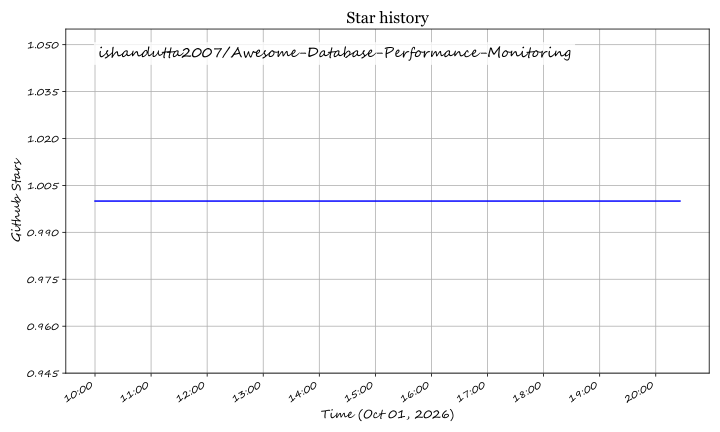

# Awesome-Database-Performance-Monitoring

## Top Database Performance Monitoring Platforms Ecosystem

**Curated List of SaaS Products & Open-Source GitHub Projects**

*Focused on Query Performance, Real-Time Metrics, Slow Query Analysis & Database Observability*

**Last updated: October 2026**

This repository tracks notable **SaaS platforms** and **open-source projects** for **Database Performance Monitoring**. These tools help DBAs and platform engineers identify slow queries, monitor resource utilization, detect anomalies, and optimize database performance across PostgreSQL, MySQL, MongoDB, and other engines.

**Examples** include SolarWinds DPA, Redgate SQL Monitor, Datadog Database Monitoring, Quest Foglight, Percona Monitoring and Management, EverSQL, Devart dbForge Monitor, Dynatrace, New Relic, and Site24x7 (the category leaders).

**Open-source emphasis**: Database performance monitoring has a **mature and production-proven open-source ecosystem**. **PMM (Percona Monitoring and Management)** is the leading open-source solution for MySQL, PostgreSQL, and MongoDB with Query Analytics and Advisor checks . **pgwatch2** provides comprehensive PostgreSQL monitoring with 200+ metrics and built-in Grafana dashboards . **PgHero** delivers a lightweight, read-only PostgreSQL performance dashboard . **MySQLTuner** offers the classic CLI-based MySQL performance analysis script . **Coroot** brings eBPF-based observability with automatic query performance insights . This section documents these production-grade solutions.

Contributions welcome! Open a PR to add/update entries. Keep descriptions factual and link to official sites.

## Table of Contents

- [SaaS/Hosted Platforms](#saas-hosted-platforms)

- [Open-Source GitHub Projects](#open-source-github-projects)

- [How to Contribute](#how-to-contribute)

- [Disclaimer](#disclaimer)

## SaaS/Hosted Platforms

- **[SolarWinds DPA](https://www.solarwinds.com/database-performance-analyzer)**

  **Deep database performance analysis with query-level wait-time monitoring.** Supports Oracle, SQL Server, MySQL, MariaDB, PostgreSQL, and Azure SQL. Provides table and index tuning advice, blocking and deadlock analysis, and historical performance baselines. Agent-based architecture with a central repository for cross-database correlation.

- **[Redgate SQL Monitor](https://www.red-gate.com/products/sql-monitor/)**

  **The leading monitoring tool for SQL Server estates.** Provides real-time and historical performance metrics, custom alerts, and automated alerts for backups, security, and capacity. **94% of Fortune 100 companies** use Redgate . Free for one server, with per-server and per-server-per-year options .

- **[Datadog Database Monitoring](https://www.datadoghq.com/product/database-monitoring/)**

  **Cloud-native database monitoring integrated with the Datadog platform.** Provides query-level metrics, execution plans, explain plans, and wait event analysis for PostgreSQL, MySQL, SQL Server, Oracle, and MongoDB. Correlates database performance with application traces and infrastructure metrics .

- **[Quest Foglight](https://www.quest.com/foglight/)**

  **Enterprise database performance monitoring for heterogeneous environments.** Supports Oracle, SQL Server, PostgreSQL, MySQL, Azure SQL, and cloud-native databases. Provides SQL Performance Investigator (SQL PI) for deep query analysis and workload profiling .

- **[EverSQL](https://www.eversql.com/)**

  **AI-powered SQL query optimization.** Automatically analyzes slow queries and provides index and query rewrite recommendations. Supports MySQL, PostgreSQL, and MariaDB. Cloud-based with continuous monitoring and automated alerts .

- **[Devart dbForge Monitor](https://www.devart.com/dbforge/monitor/)**

  **Free SQL Server performance monitoring.** Features real-time wait statistics, top slow queries, index fragmentation analysis, and disk space monitoring. Part of the dbForge product family.

- **[Dynatrace](https://www.dynatrace.com/)**

  **Full-stack observability with database performance monitoring.** Provides automatic discovery and monitoring of databases, query performance analysis, and root cause detection. Supports major databases and cloud-native environments.

- **[New Relic](https://newrelic.com/)**

  **APM platform with database performance monitoring.** Provides query-level metrics, execution plan analysis, and database-specific dashboards. Integrates with the broader New Relic observability platform.

- **[Site24x7](https://www.site24x7.com/)**

  **Cloud-based infrastructure and database monitoring.** Provides MySQL, PostgreSQL, Microsoft SQL Server, and MongoDB monitoring with query analysis, slow query tracking, and alerting.

## Open-Source GitHub Projects

### Multi-Database Monitoring Platforms

- **[Percona Monitoring and Management (PMM)](https://github.com/percona/pmm)**

  **The leading open-source database monitoring solution for MySQL, PostgreSQL, MongoDB, and MariaDB.** **AGPL-3.0 licensed**. Built on Prometheus and VictoriaMetrics with Grafana dashboards. **Key features**: **Query Analytics (QAN)** for slow query analysis; **Advisors** for automated best-practice checks; **Alerting** and **Integration** with external systems. Docker and Podman deployment with a web-based UI. **Best for**: Production MySQL/PostgreSQL/MongoDB environments needing a complete monitoring stack .

- **[pgwatch2](https://github.com/cybertec-postgresql/pgwatch2)**

  **Comprehensive PostgreSQL monitoring with 200+ built-in metrics.** **PostgreSQL license**. Provides **predefined Grafana dashboards**, **preset configurations**, and **automatic metric collection**. Supports multiple monitoring modes including Prometheus, Graphite, and JSON. **Best for**: PostgreSQL-specific monitoring with granular metrics and dashboards.

- **[Coroot](https://github.com/coroot/coroot)**

  **eBPF-based observability platform with automatic database monitoring.** **Apache-2.0 licensed**. Uses eBPF to collect metrics without instrumentation. Provides **automatic service discovery**, **query performance insights**, and **distributed tracing**. Supports PostgreSQL, MySQL, and MongoDB. **Best for**: Kubernetes and cloud-native environments wanting zero-instrumentation monitoring .

### PostgreSQL-Specific Monitoring

- **[PgHero](https://github.com/ankane/pghero)**

  **Lightweight, read-only PostgreSQL performance dashboard.** **MIT licensed**. Provides **query performance analysis**, **index usage statistics**, **table and index bloat detection**, and **connection monitoring**. Web-based UI with no agent required. **Best for**: PostgreSQL users wanting a quick, low-overhead monitoring solution.

- **[pg_stat_monitor](https://github.com/percona/pg_stat_monitor)**

  **Query performance monitoring extension for PostgreSQL.** **PostgreSQL license**. Provides **aggregated query statistics**, **query execution plans**, **client information**, and **histogram data**. Part of the Percona ecosystem. **Best for**: PostgreSQL users needing advanced query-level monitoring.

- **[PoWA](https://github.com/powa-team/powa)**

  **PostgreSQL Workload Analyzer.** **PostgreSQL license**. Collects performance statistics from multiple PostgreSQL instances and provides **real-time metrics**, **query analysis**, and **histograms**. Supports **pg_stat_statements** and **pg_qualstats**. **Best for**: PostgreSQL workload analysis and historical performance tracking.

### MySQL/MariaDB-Specific Monitoring

- **[MySQLTuner-perl](https://github.com/major/MySQLTuner-perl)**

  **The classic CLI-based MySQL/MariaDB performance analysis script.** **GPL-3.0 licensed**, Perl-based. Analyzes MySQL/MariaDB configuration and performance metrics to provide **tuning recommendations**. Checks **query cache**, **index usage**, **connection settings**, **storage engine configuration**, and more. **Best for**: Quick CLI-based MySQL tuning and configuration review .

- **[MySQL Performance Schema](https://dev.mysql.com/doc/refman/8.0/en/performance-schema.html)**

  **Built-in MySQL monitoring framework.** Native to MySQL 5.7+ and 8.0. Provides **instrumentation** for server events, **wait statistics**, **statement analysis**, and **connection tracking**. Foundation for many monitoring tools. **Best for**: Native MySQL monitoring without additional agents.

- **[PMM for MySQL](https://www.percona.com/software/database-tools/percona-monitoring-and-management)** — See PMM above.

### Additional Strong Open-Source Options

- **Multi-Database**: **PMM** (MySQL, PostgreSQL, MongoDB), **Coroot** (eBPF-based, Kubernetes-native) .

- **PostgreSQL**: **pgwatch2** (200+ metrics), **PgHero** (lightweight dashboard), **pg_stat_monitor** (query stats extension), **PoWA** (workload analyzer) .

- **MySQL**: **MySQLTuner** (CLI tuning script), **PMM for MySQL** .

- **MongoDB**: **PMM for MongoDB** .

- **Cloud-Native**: **Coroot** (eBPF, zero-instrumentation), **PMM** (Prometheus-based) .

**Frameworks for building custom systems**: Combine **PMM** for multi-database monitoring with Query Analytics and Advisors, **pgwatch2** or **PgHero** for PostgreSQL-specific dashboards, **MySQLTuner** for quick CLI-based MySQL tuning, **Coroot** for eBPF-based zero-instrumentation observability in Kubernetes, and **pg_stat_monitor** for deep query-level PostgreSQL statistics. Add **Prometheus** for metrics collection, **Grafana** for visualization, and **Docker** for deployment.

## How to Contribute

1. Fork the repo.

2. Add/edit entries in `README.md` (follow existing format).

3. Include: name, link, 1–2 sentence description, and whether it's SaaS or open-source.

4. Submit PR with a short explanation.

Star the repo if you find it useful!

## Disclaimer

- This is a **community-curated** list — not exhaustive and not an endorsement.

- Database performance monitoring platforms handle sensitive query and performance data; ensure proper access controls and compliance with security policies.

- **Open-source reality**: The open-source ecosystem for database performance monitoring is **mature and production-proven**. **PMM** is the leading open-source solution for MySQL, PostgreSQL, and MongoDB with Query Analytics and Advisors . **pgwatch2** provides 200+ PostgreSQL metrics with Grafana dashboards . **PgHero** offers a lightweight, read-only PostgreSQL dashboard . **MySQLTuner** remains the classic CLI-based MySQL tuning script . **Coroot** brings eBPF-based zero-instrumentation monitoring for cloud-native environments . However, **commercial platforms** (SolarWinds DPA, Redgate SQL Monitor, Datadog, Quest Foglight) provide **deep query-level wait analysis, automated tuning, cross-database correlation, and enterprise support** that open-source alternatives require additional tooling to match. The open-source path is **genuinely viable** for organizations with strong DBA and observability engineering capacity.

---

**Made for DBAs, platform engineers, SREs, and database performance specialists.**

Let's make database performance monitoring more open, transparent, and observable.

## ⭐ Star History

<a href="https://star-history.com/#ishandutta2007/Awesome-Database-Performance-Monitoring&Timeline" align="center">
  <picture>
    <source media="(prefers-color-scheme: dark)" srcset="assets/ishandutta2007_Awesome-Database-Performance-Monitoring_growth.svg">
    
  </picture>
</a>
